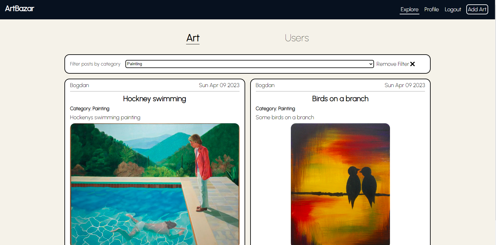

# ArtBazar

Social website dedicated to artists for an easier way to share their work to the world. Built with React and Spring Boot and PostgreSQL. 

The main idea is that there are 2 types of users: **Artists** and **Explorers**. *Artists* will be able to post their art based on categories, and *Explorers* will be able to interact with *Artists*, rate their works and even commision works from them.


## Setup

You can set up the app locally with **Docker** and **Docker Compose**:

```
docker-compose up -d
```

And then go to the local server at http://localhost:3000/. Currently there is no initial database set up.

## Features

The project is supposed to have a big variety of features. Here is the current state of the app:

### Added Features

* Register and Login functionalities
* Main page for new users
* *Artists* can post their works for others to see
* Comment functionality on posts
* Main dashboard where you can see all the posts
* "Random Art" button to find new artists you don't know about
* Profile customization
* Possibiliy to Follow other users
* Add "Explore" section where you can find other artists to follow
* More types of posts (general posts, art posts)

### To be added

* Make *Explorers* be able to commission works from *Artists*
* Make *Explorers* be able to create fanclubs (whatever that may mean) for an artist or more artists
* Add "looking for commissioner" post for *Explorers* 
* Show posts on feed based on preferences and follows
* Functionality for *Explorers* to rate and review *Artists*
* Add initial database to showcase most of the functionalities working togheter
* Add frontend tests
* Add backend tests
* Add responsive design
* Migrate frontend to Typescript
* Explore Spring Boot ecosystem for more features (such as multithreading, RxJava, microservices etc...)
* Add some media to the repo
* Add "Like post" functionality
* Add Ecommerce microservice and connect the microservices using a messaging queue
* Come up with a logo using figma or other design tools
* Generate users and content using generative machine learning tools
* !! Add a "AI Art" or "Generate AI Art" section using some form of ML
* !! Integrate "Art assistant" functionality using LLM or other ML tools
* Maybe add support for audio files (for musicians)

## Media

Media presenting the main app views/screens:

Front Page


Register Page


Customized Dashboard


Explore Art Section



Profile Page


Book Detail


User Profile

